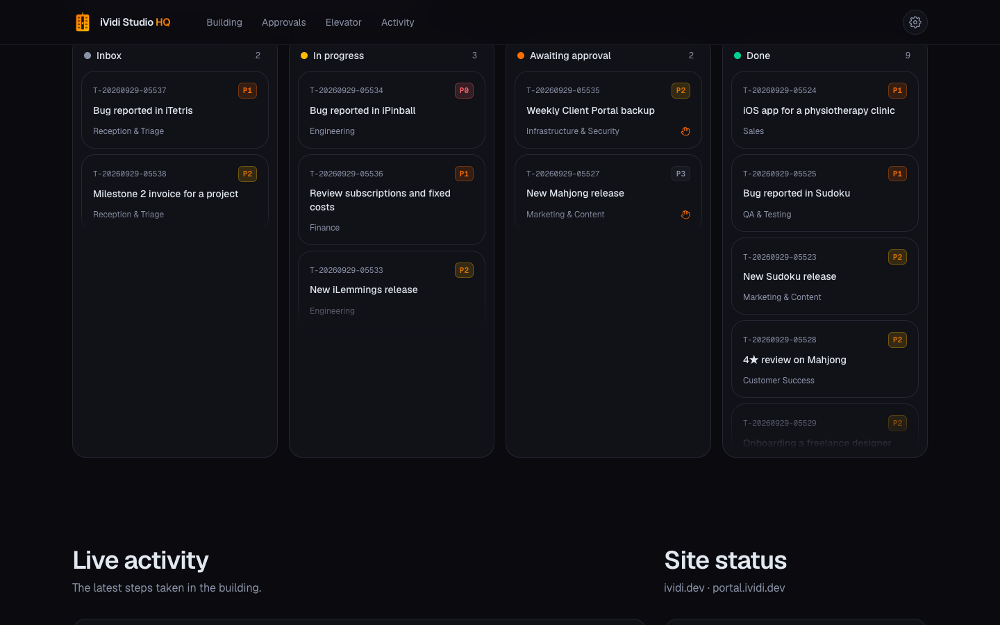

# iVidi Studio HQ 🏢

> A live showcase of iVidi Studio running as a twelve-floor building: every floor a department, every request a ticket riding the elevator, and every decision with real impact waiting for a human.

[](https://ividistudio.vercel.app)
[](https://github.com/VidiPT89/iVidiStudio/issues)
[](https://github.com/VidiPT89/iVidiStudio/issues)

<picture>
  <source media="(prefers-color-scheme: light)" srcset="docs/screenshots/hero-light.png">
  
</picture>

## ✨ Features

- ✅ Live simulation of the whole studio: new requests arrive every few seconds, get triaged at Reception, ride the elevator and pass through the right teams
- ✅ Built from iVidi Studio's real products and services — iTetris, iPinball, iLemmings, iSudoku, iSueca, iSolitaire, iMahjong, iPetanque, iXadrez, PhotographersPocketKnife, iSpoonFit, Next.js sites, Salesforce work — with fictional requests and clients, so no private details are ever shown
- ✅ Deterministic by the clock: every visitor sees the same building at the same moment, with no server, no database and no personal data
- ✅ Interactive building whose elevator car follows the work, lit windows for busy floors, and a panel with each floor's mission, team and KPIs
- ✅ Human gate: proposals, store releases, deploys, invoices and contracts always stop and wait for approval
- ✅ Live ticket board where cards glide between Inbox, In progress, Awaiting approval and Done, plus a live activity feed
- ✅ Real uptime of ividi.dev and the Client Portal
- ✅ The operating model behind it: twelve floors with processes and templates, twenty Claude Code agents, eight slash commands and a hook that keeps each agent on its own floor
- ✅ Animated splash screen with developer credits once per browser session, then straight into the building
- ✅ Settings panel with a bilingual PT-PT / English switch and Dark, Light and System appearance, in the iVidi.dev orange, burnt yellow and black

<p align="center">
  
  <picture>
    <source media="(prefers-color-scheme: light)" srcset="docs/screenshots/building-light.png">
    
  </picture>
</p>

<p align="center">
  
</p>

## 🛠️ Tech Stack

| Category | Technology |
|----------|------------|
| Web | Next.js 16 (App Router), React 19, TypeScript |
| Styling | Tailwind CSS 4 |
| Animation | Motion |
| Operating model | Claude Code subagents, slash commands and hooks |
| Automation | GitHub Actions (uptime, CI) |
| Testing | Vitest |
| Hosting | Vercel |

## 🗂️ Project Structure

```
iVidiStudio/
├── dashboard/           the live showcase (Next.js)
│   └── src/lib/simulation.ts   the studio, generated from the clock
├── CLAUDE.md            building rules (PT-PT) every agent follows
├── docs/planta.md       floor plan with Mermaid diagrams (PT-PT)
├── docs/exemplos/       worked examples: one ticket per floor and their records
├── elevador/            ticket states: entrada/ · em-curso/ · aguarda-aprovacao/ · concluido/
├── pisos/               the 12 floors: README · processos/ · templates/ · registos/
├── empresa/             mission, brand, pricing and product catalogue
├── .claude/             agents/ · commands/ · hooks/ · settings.json
└── .github/             uptime check and CI
```

## 🚀 Quick Start

### Prerequisites

- Node.js 20+

### Installation

```bash
git clone https://github.com/VidiPT89/iVidiStudio.git
cd iVidiStudio/dashboard
npm install
npm run dev
```

Open [http://localhost:3000](http://localhost:3000). No environment variables are needed.

## 📖 Usage

1. Watch the splash screen, then the building starts working on its own
2. Follow the elevator, or pick a floor to see its team, KPIs and what it has in hand — **Follow the elevator** takes you back to live
3. Open any ticket to watch its journey through the building update live
4. Keep an eye on **Human gate**: nothing with real impact happens until it has been approved
5. Open **Settings** (the gear in the header) to switch language (PT / EN) and appearance (System / Light / Dark)

## 🔌 API Endpoints

| Method | Endpoint | Description |
|--------|----------|-------------|
| `GET` | `/api/status` | Uptime and response time of ividi.dev and portal.ividi.dev (cached for 5 minutes) |

## 🧪 Testing

```bash
cd dashboard
npm run lint
npm run typecheck
npm test
npm run build
```

The tests cover the simulation (same building for every visitor, consistent counters, tickets walking the floors in order, the human gate, both languages and Portuguese grammar), the hook that keeps every agent on its own floor and away from secrets, and that both languages define and use the same strings for every floor.

## 📄 License

Distributed under the MIT License. See [LICENSE](LICENSE) for details.

## 👨‍💻 Author

**David Arsénio Martins**

- 🌐 Website: [ividi.dev](https://ividi.dev)
- 🐙 GitHub: [@VidiPT89](https://github.com/VidiPT89)

## 🤝 Contributing

Contributions, issues and feature requests are welcome. Feel free to check the [issues page](https://github.com/VidiPT89/iVidiStudio/issues).

---

<p align="center">Developed by <a href="https://ividi.dev">David Arsénio Martins</a></p>
<p align="center">⭐ If you like this project, give it a star!</p>
