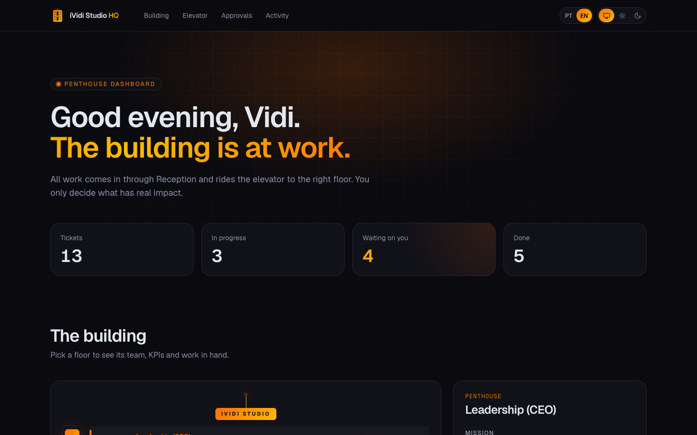
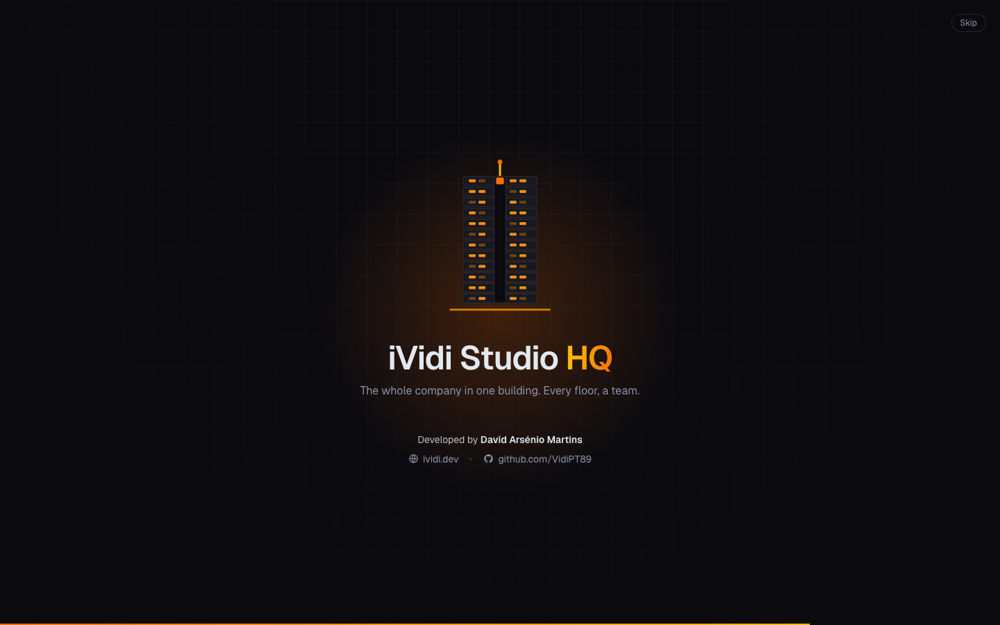
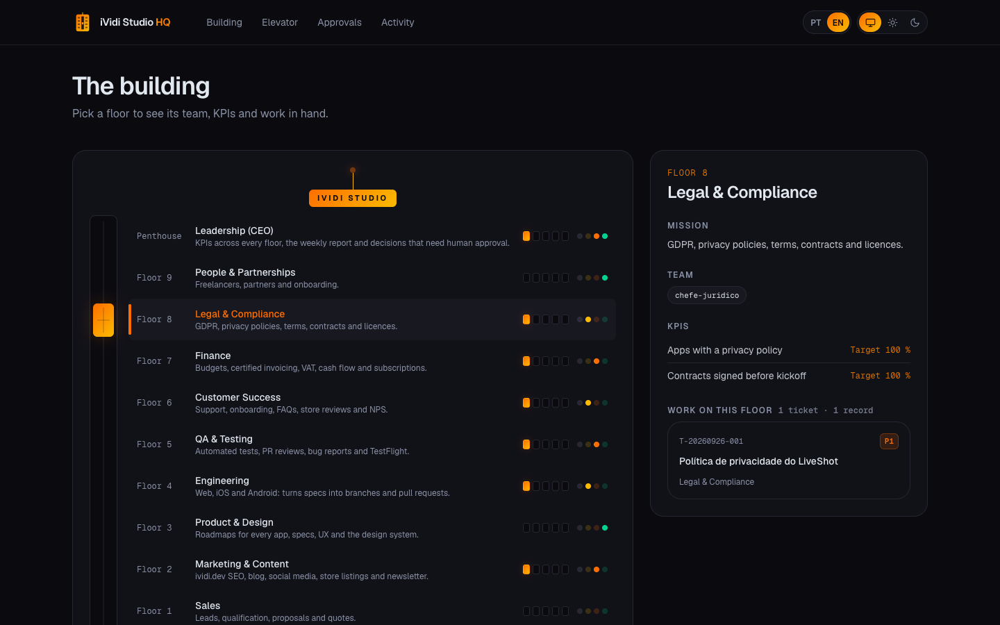

# iVidi Studio HQ 🏢

> The whole iVidi Studio company run as a twelve-floor building: every floor a department with its own team of agents, every request a ticket riding the elevator, and a penthouse dashboard where only the decisions with real impact wait for a human.

[](https://github.com/VidiPT89/iVidiStudio/issues)
[](https://github.com/VidiPT89/iVidiStudio/issues)

<picture>
  <source media="(prefers-color-scheme: light)" srcset="docs/screenshots/hero-light.png">
  
</picture>

## ✨ Features

- ✅ Twelve floors, from the Basement (Infrastructure & Security) to the Penthouse (Leadership), each with its mission, KPIs, step-by-step processes, templates and a decision log
- ✅ The elevator: a ticket system made of plain Markdown files — changing state means moving the file between `entrada/`, `em-curso/`, `aguarda-aprovacao/` and `concluido/`, so every step is versioned in git
- ✅ Twenty Claude Code agents — a floor manager for every floor, specialists for web, iOS, Android, proposals, store listings and UX, and a doorman who triages every new request
- ✅ Eight slash commands as the elevator buttons: `/novo-pedido`, `/triagem`, `/piso`, `/ronda`, `/aprovacoes`, `/relatorio-semanal`, `/lancar-app` and `/novo-cliente`
- ✅ Human gate: emails to clients, publishing, merging to `main`, production deploys, invoices, contracts, spending and deleting data never happen automatically
- ✅ Floor boundaries enforced by a hook — an agent can only write to its own floor and to the elevator, and nobody reads `.env` files
- ✅ Scheduled automation on GitHub Actions: hourly triage, a daily round at 08:00 Lisbon time, a Monday weekly report and a daily uptime check, all behind a single on/off switch
- ✅ Client Portal webhook that turns a signed request into a ticket, validating the payload and stripping emails, phone numbers and tax IDs (GDPR)
- ✅ Penthouse dashboard with an interactive building whose elevator car rides to the selected floor, a live board of every ticket, the approval queue, recent activity and site status
- ✅ Animated splash screen with developer credits, then straight into the dashboard
- ✅ Bilingual PT-PT / English switch, independent of your browser language
- ✅ Dark, Light and System appearance, with the iVidi.dev orange, burnt yellow and black
- ✅ Worked examples on every floor, including a guided tour: a Cascais restaurant's request travelling from Reception to the Penthouse

<p align="center">
  
  
</p>

## 🛠️ Tech Stack

| Category | Technology |
|----------|------------|
| Dashboard | Next.js 16 (App Router), React 19, TypeScript |
| Styling | Tailwind CSS 4 |
| Animation | Motion |
| Agents | Claude Code subagents, slash commands and hooks |
| Automation | GitHub Actions |
| Tickets & records | Markdown with YAML front matter |
| Testing | Vitest |
| Hosting | Vercel |

## 🗂️ Project Structure

```
iVidiStudio/
├── CLAUDE.md            building rules (PT-PT) every agent follows
├── docs/planta.md       floor plan with Mermaid diagrams (PT-PT)
├── elevador/            tickets: entrada/ · em-curso/ · aguarda-aprovacao/ · concluido/
├── pisos/               the 12 floors: README · processos/ · templates/ · registos/
├── empresa/             mission, brand, pricing and product catalogue
├── .claude/             agents/ · commands/ · hooks/ · settings.json
├── .github/             scheduled workflows and the shared "run a floor" action
└── dashboard/           the penthouse dashboard (Next.js)
```

## 🚀 Quick Start

### Prerequisites

- Node.js 20+
- [Claude Code](https://claude.com/claude-code) to run the agents and commands

### Installation

```bash
git clone https://github.com/VidiPT89/iVidiStudio.git
cd iVidiStudio/dashboard
npm install
npm run dev
```

Open [http://localhost:3000](http://localhost:3000). The dashboard reads the building (`elevador/` and `pisos/`) when it starts and at every build.

## 📖 Usage

1. Open Claude Code at the repository root and drop a request in: `/novo-pedido A restaurant in Cascais wants a website with bookings`
2. Run `/triagem` — the doorman classifies it and sends it to the right floor
3. Run `/piso 1` (or `/ronda` for every floor) to let the floor managers do the work
4. Check `/aprovacoes` every day: approve with `/aprovacoes aprovar <id>` or send it back with `/aprovacoes rejeitar <id> "comment"`
5. Follow everything on the dashboard — pick a floor to see its team, KPIs and work, open any ticket to read its history
6. Switch language (PT / EN) and appearance (System / Light / Dark) from the header

### Turning on the automation

The workflows stay off until you switch them on, and they run on your Claude subscription, with no paid API key:

1. Run `claude setup-token` and add the token as the repository secret `CLAUDE_CODE_OAUTH_TOKEN`
2. Add the repository variable `IVIDI_AUTOMACAO` with the value `ligada`

The daily uptime check and CI need neither.

## 🔌 API Endpoints

| Method | Endpoint | Description |
|--------|----------|-------------|
| `GET` | `/api/status` | Uptime and response time of ividi.dev and portal.ividi.dev (cached for 5 minutes) |
| `POST` | `/api/portal` | Client Portal webhook — creates a ticket in `elevador/entrada/`. Body signed with HMAC-SHA256 in `x-ividi-signature: sha256=<hex>` |

`POST /api/portal` body:

```json
{
  "clientRef": "CLI-0007",
  "type": "pedido-cliente",
  "title": "New website",
  "summary": "What the client asked for",
  "priority": "P2"
}
```

Configure `PORTAL_WEBHOOK_SECRET`, `GITHUB_TOKEN` (fine-grained, contents: write on this repository) and `GITHUB_REPO` — see [`dashboard/.env.example`](dashboard/.env.example).

## 🧪 Testing

```bash
cd dashboard
npm run lint
npm run typecheck
npm test
npm run build
```

The tests cover the ticket and record parser, the webhook validation and GDPR redaction, ticket numbering, and that both languages define and use the same strings for every floor.

## 📄 License

Distributed under the MIT License. See [LICENSE](LICENSE) for details.

## 👨‍💻 Author

**David Arsénio Martins**

- 🌐 Website: [ividi.dev](https://ividi.dev)
- 🐙 GitHub: [@VidiPT89](https://github.com/VidiPT89)

## 🤝 Contributing

Contributions, issues and feature requests are welcome. Feel free to check the [issues page](https://github.com/VidiPT89/iVidiStudio/issues).

---

<p align="center">Developed by <a href="https://ividi.dev">David Arsénio Martins</a></p>
<p align="center">⭐ If you like this project, give it a star!</p>
