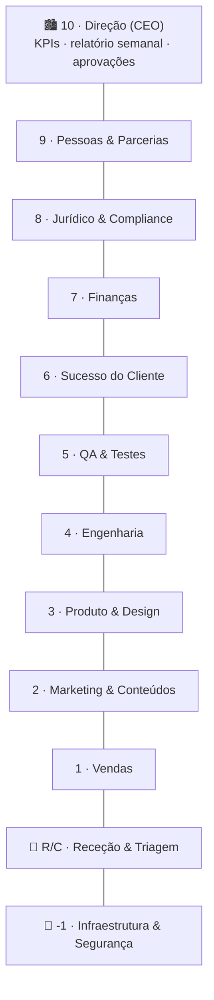
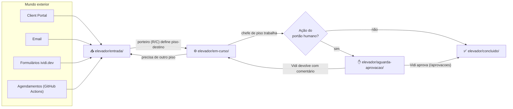

# iVidi HQ — Planta do Edifício

A estrutura operacional da **iVidi Studio** ([ividi.dev](https://ividi.dev) · [Client Portal](https://portal.ividi.dev)),
organizada como um edifício de 12 pisos. Cada piso é um departamento com a sua equipa de agentes
Claude Code, processos e registos. O trabalho circula pelo **elevador**: tickets em ficheiros Markdown.

Regras globais: [`CLAUDE.md`](../CLAUDE.md) · Identidade: [`empresa/`](../empresa/) · Painel: [`dashboard/`](../dashboard/)

## Os pisos



| Piso | Pasta | Departamento | Missão |
|------|-------|--------------|--------|
| -1 | [`pisos/-1-infraestrutura`](../pisos/-1-infraestrutura/) | Infraestrutura & Segurança | CI/CD, deploys (Vercel/Railway/Cloudflare), backups, monitorização, segredos |
| 0 | [`pisos/00-rececao`](../pisos/00-rececao/) | Receção & Triagem | Recebe pedidos (portal, email, formulários), classifica e encaminha |
| 1 | [`pisos/01-vendas`](../pisos/01-vendas/) | Vendas | Leads, qualificação, propostas e orçamentos |
| 2 | [`pisos/02-marketing`](../pisos/02-marketing/) | Marketing & Conteúdos | SEO, blog, redes sociais, fichas das lojas, newsletter |
| 3 | [`pisos/03-produto`](../pisos/03-produto/) | Produto & Design | Roadmaps, specs, UX, design system |
| 4 | [`pisos/04-engenharia`](../pisos/04-engenharia/) | Engenharia | Web, iOS, Android — implementa specs em branches e abre PRs |
| 5 | [`pisos/05-qa`](../pisos/05-qa/) | QA & Testes | Testes automáticos, revisão de PRs, bugs, TestFlight |
| 6 | [`pisos/06-sucesso-cliente`](../pisos/06-sucesso-cliente/) | Sucesso do Cliente | Suporte, onboarding, FAQs, reviews, NPS |
| 7 | [`pisos/07-financas`](../pisos/07-financas/) | Finanças | Orçamentos, faturação certificada, IVA, tesouraria, subscrições |
| 8 | [`pisos/08-juridico`](../pisos/08-juridico/) | Jurídico & Compliance | RGPD, privacidade, termos, contratos, licenças |
| 9 | [`pisos/09-pessoas`](../pisos/09-pessoas/) | Pessoas & Parcerias | Freelancers, parceiros, onboarding |
| 10 | [`pisos/10-direcao`](../pisos/10-direcao/) | Direção (CEO) | KPIs, relatório semanal, decisões humanas |

## O elevador



**Portão humano** — nunca automático: emails/mensagens a clientes, publicações (redes e lojas),
merge em `main`, deploy em produção, faturas, contratos, gastos, apagar dados.

## Estrutura do repositório

```
ividi-hq/
  CLAUDE.md            regulamento do edifício
  README.md            apresentação do projeto (EN)
  docs/planta.md       esta planta
  elevador/            entrada/ em-curso/ aguarda-aprovacao/ concluido/ + TEMPLATE.md
  pisos/<piso>/        README.md · processos/ · templates/ · registos/
  empresa/             missão, visão, valores, marca, preços, catálogo
  .claude/             agents/ (20) · commands/ (8) · hooks/ · settings.json
  .github/             workflows/ (uptime, CI)
  dashboard/           montra ao vivo (Next.js)
```

## Estado da construção

- [x] Fase 1 — Fundações
- [x] Fase 2 — A equipa (20 agentes em `.claude/agents/`)
- [x] Fase 3 — Comandos (8 botões do elevador em `.claude/commands/`)
- [x] Fase 4 — Hooks de fronteira entre pisos e monitorização de uptime
- [x] Fase 5 — Painel da Cobertura como montra ao vivo (`dashboard/`)

## A montra ao vivo

O painel em [`dashboard/`](../dashboard/) é uma **demonstração pública** (https://ividistudio.vercel.app) para o ividi.dev:
mostra a empresa a funcionar sozinha, com os produtos e serviços reais da iVidi Studio, mas com pedidos e clientes fictícios.
A simulação é uma função da hora (`dashboard/src/lib/simulation.ts`): todos os visitantes veem o mesmo edifício ao mesmo tempo,
sem servidor, sem base de dados e sem dados pessoais. As ações com impacto real param sempre no portão humano.

O trabalho real da iVidi Studio é feito pelo Vidi; os agentes e os comandos continuam disponíveis para usar à mão no Claude Code.

## Visita guiada

O ticket de exemplo [`T-20260922-001`](exemplos/elevador/aguarda-aprovacao/T-20260922-001-site-restaurante-cascais.md) é um pedido de um restaurante em Cascais
que passou por Receção → Vendas → Jurídico → Finanças → Direção. Os registos de cada piso estão ligados
na secção "Trabalho feito" do ticket (estão em `docs/exemplos/pisos/`).
